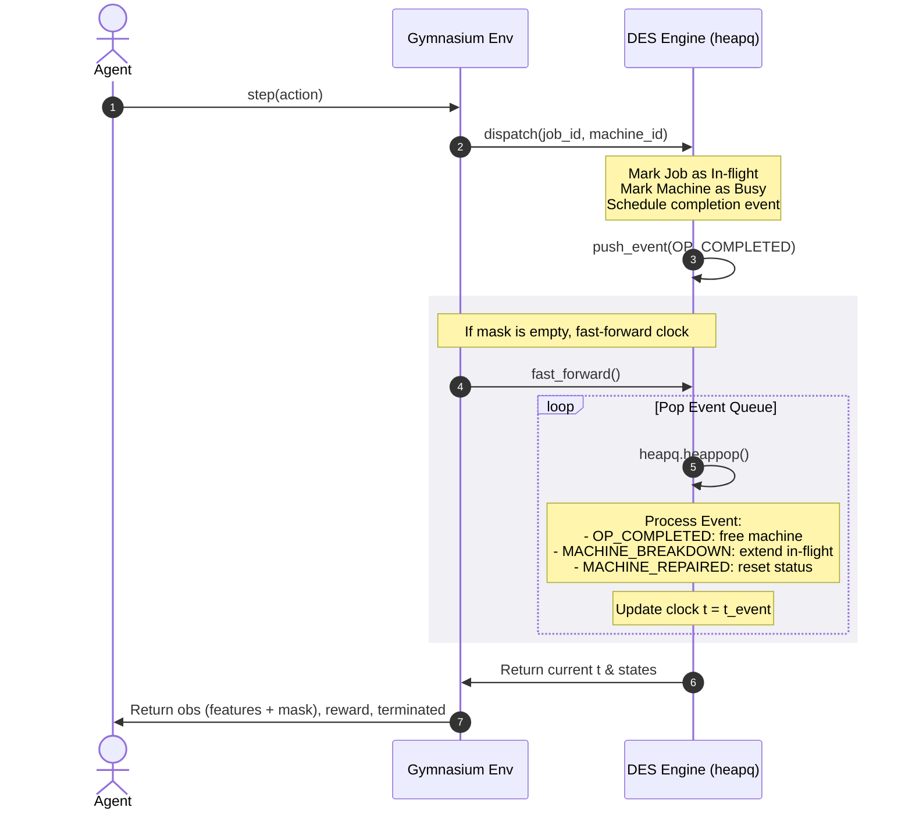
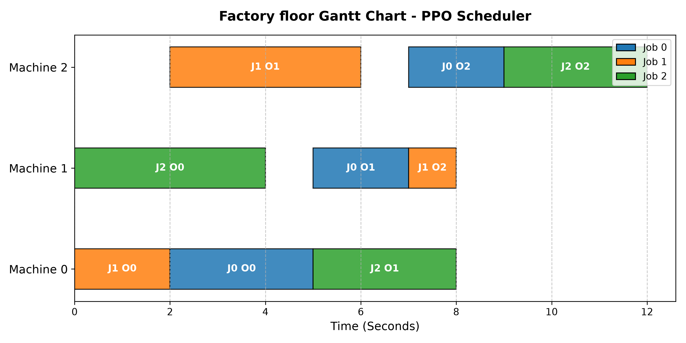
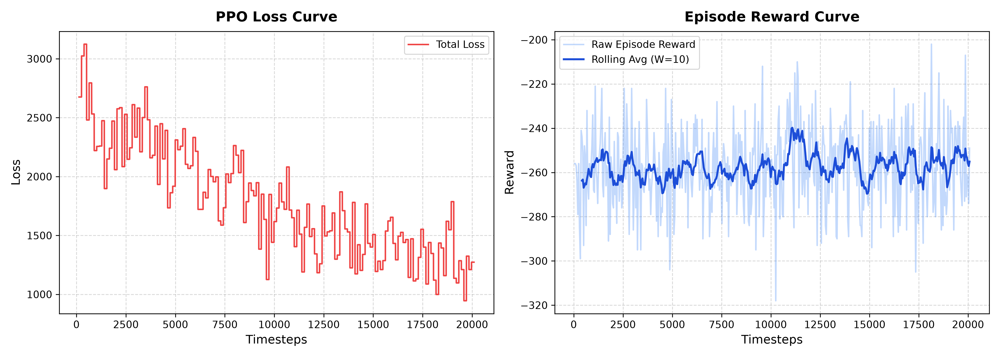
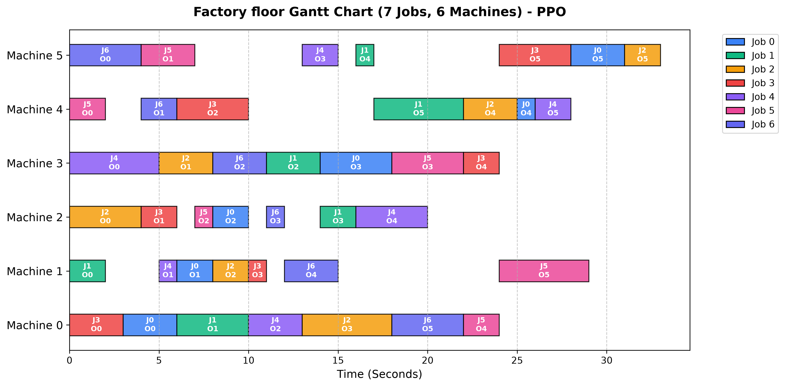
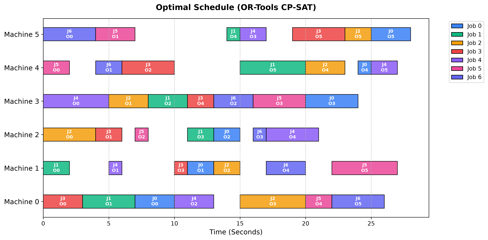
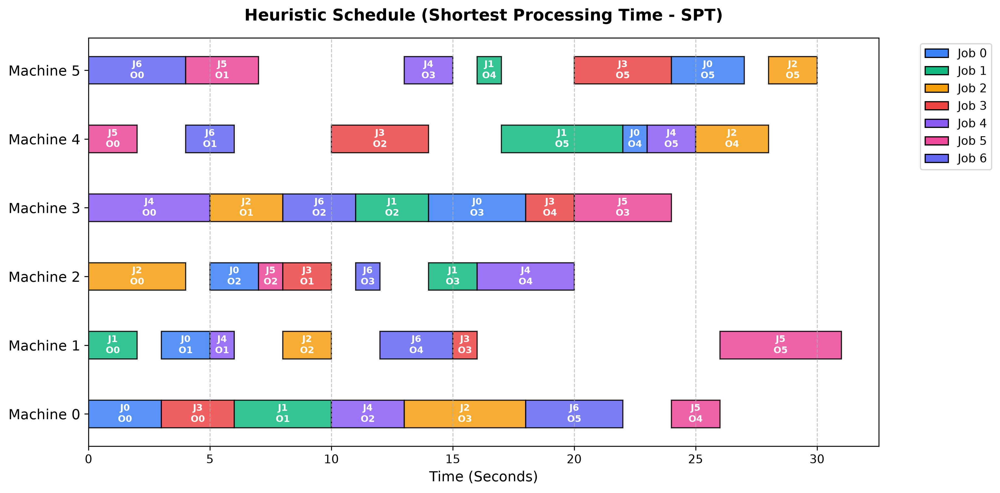
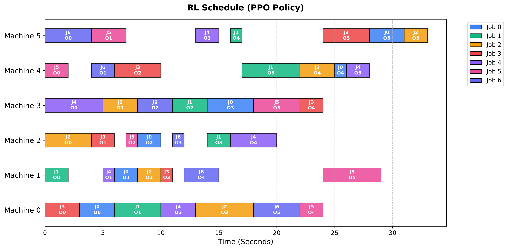

# Job Shop Scheduling (JSS/FJSP) Gym & Digital Twin Platform

An extremely high-performance, modular, and event-driven **Discrete-Event Simulation (DES) Engine** and **Gymnasium Environment** for Job Shop Scheduling (JSS) and Flexible Job Shop Scheduling (FJSP).

This platform serves as a high-fidelity digital twin of a factory floor, modeling stochastic machine breakdowns, Poisson-distributed dynamic job arrivals, sequence-dependent setup times, and physical buffer limitations. It integrates classical operations research solvers (Google OR-Tools CP-SAT) alongside modern deep reinforcement learning (Stable-Baselines3).

---

> [!TIP]
> ### 1-Click Quickstart: Launch the Visual Scenario Designer
> You can launch the interactive scenario designer immediately without touching the command line or manually installing packages:
> - **macOS**: Double-click [`Launch_Designer.command`](Launch_Designer.command) in Finder.
> - **Windows**: Double-click [`Launch_Designer.bat`](Launch_Designer.bat) in File Explorer.
>
> *These launchers are **self-bootstrapping**: they automatically verify Python 3, create a local virtual environment (`venv`), install all required dependencies from [`requirements.txt`](requirements.txt), and open the web app in your default browser.*

---

## Table of Contents

0. [1-Click Quickstart Launcher](#1-click-quickstart-launch-the-visual-scenario-designer)

1. [Project Directory Layout](#1-project-directory-layout)
2. [Mathematical Formulations](#2-mathematical-formulations)
3. [DES Engine Architecture](#3-des-engine-architecture)
4. [Gymnasium Environment Contract](#4-gymnasium-environment-contract)
5. [Digital Twin & Stochastic Mechanics](#5-digital-twin--stochastic-mechanics)
6. [OR-Tools CP-SAT Solver Configuration](#6-or-tools-cp-sat-solver-configuration)
7. [Reinforcement Learning Integration](#7-reinforcement-learning-integration)
8. [Class & Method Reference API](#8-class--method-reference-api)
9. [Installation & Setup](#9-installation--setup)
10. [Usage Quickstart](#10-usage-quickstart)
11. [Gantt Chart Output Example](#11-gantt-chart-output-example)
12. [Custom Benchmark & Comparative Analysis (7x6 Instance)](#12-custom-benchmark--comparative-analysis-7x6-instance)
13. [Visual Scenario Designer (No-Code Tool for Teams)](#13-visual-scenario-designer-no-code-tool-for-teams)
14. [Size-Agnostic GNN / Attention Reinforcement Learning (Phase 3)](#14-size-agnostic-gnn--attention-reinforcement-learning-phase-3)

---

## 1. Project Directory Layout

```text
JobRL/
├── app.py                     # Streamlit visual scenario designer & exporter web app
├── designer_core.py           # Scenario data models, presets, validation & code exporter
├── Launch_Designer.command    # 1-click self-bootstrapping launcher for macOS
├── Launch_Designer.bat        # 1-click self-bootstrapping launcher for Windows
├── requirements.txt           # Project and UI dependencies
├── config.py                  # Environment and simulator dataclass configurations
├── engine.py                  # Discrete-Event Simulation (DES) state and heapq engine
├── env.py                     # Gymnasium environment wrapper and reward formulation
├── optimizer.py               # Google OR-Tools CP-SAT exact mathematical solver
├── train.py                   # Observation flattening and SB3 RL wrapper
├── gnn_policy.py              # Size-agnostic Bipartite Graph Attention Actor-Critic policy (PyTorch)
├── variable_env.py            # Size-agnostic procedural environment supporting variable (N, M)
├── train_gnn.py               # Procedural PPO training pipeline with GAE & auto device (MPS/CUDA/CPU)
├── compare_gnn.py             # Multi-instance zero-shot benchmark suite vs CP-SAT and heuristics
├── test_gnn_policy.py         # Unit tests for GNN policy, permutation invariance & variable shapes
├── checkpoints_gnn/           # Trained size-agnostic GNN policy checkpoints
├── benchmark_results_gnn/     # Zero-shot benchmark Gantt charts across diverse instance sizes
├── gnn_training_curves.png    # Training reward and makespan convergence curves
├── test_env.py                # Comprehensive unit testing and verification suite
├── test_designer_core.py      # Unit tests for designer models, presets & validation
├── test_designer_export.py    # Integration tests verifying exported parameters
├── demo_gantt.py              # Rollout script generating schedule visualization
├── custom/                    # Custom 7x6 benchmark suite, training & comparison scripts
│   ├── train_custom.py             # Custom PPO training with loss & reward curves logging
│   ├── compare_methods.py          # Benchmark comparing OR-Tools, PPO, and SPT heuristic
│   ├── training_curves.png         # PPO training loss and episode reward curves
│   ├── custom_gantt_chart.png      # PPO rollout Gantt chart for 7x6 instance
│   ├── gantt_cpsat.png             # Optimal schedule Gantt chart (OR-Tools CP-SAT)
│   ├── gantt_ppo.png               # PPO policy Gantt chart
│   └── gantt_spt.png               # SPT heuristic Gantt chart
├── venv/                      # Python virtual environment (dependencies)
└── README.md                  # In-depth technical documentation
```

---

## 2. Mathematical Formulations

### A. Classic Job Shop Scheduling (JSS)

A JSS problem consists of a set of $n$ jobs $\mathcal{J} = \{J_0, \dots, J_{n-1}\}$ and a set of $m$ machines $\mathcal{M} = \{M_0, \dots, M_{m-1}\}$.

1. **Precedence Constraint**: Each job $J_i$ has a sequence of $m$ operations $\mathcal{O}_i = (O_{i,0}, \dots, O_{i,m-1})$ that must be processed sequentially:
   $$\text{Start}(O_{i,k}) \ge \text{End}(O_{i,k-1}) \quad \forall i, \; \forall k \in \{1, \dots, m-1\}$$
2. **Unary Machine Capacity**: Each machine processes at most one job at a time:
   $$\forall O_{i,k}, O_{j,l} \text{ where } \mu(O_{i,k}) = \mu(O_{j,l}) \implies [\text{Start}(O_{i,k}), \text{End}(O_{i,k})) \cap [\text{Start}(O_{j,l}), \text{End}(O_{j,l})) = \emptyset$$
3. **Makespan Minimization**:
   $$C_{\max} = \max_{i \in \mathcal{J}} \text{End}(O_{i, m-1})$$

### B. Flexible Job Shop Scheduling (FJSP)

In FJSP, each operation $O_{i,k}$ can run on alternative machines. The set of compatible machines is $\mathcal{M}(O_{i,k}) \subseteq \mathcal{M}$. The processing duration $p_{i,k,j}$ is machine-dependent. The engine resolves:

- **Routing**: Assigning $O_{i,k}$ to machine $M_j \in \mathcal{M}(O_{i,k})$.
- **Sequencing**: Ordering selected operations on machine $M_j$.

---

## 3. DES Engine Architecture

The simulator avoids time-slicing ($\Delta t = 1$) to eliminate idle clock ticks. It utilizes a priority queue managing continuous-time event execution.



### Event Priority Definitions

Tie-breaking at identical timestamps is handled via strict integer priorities:

1. `OP_COMPLETED` (Priority `1`): Frees resources immediately.
2. `JOB_ARRIVED` (Priority `2`): Releases new jobs to the shop floor.
3. `MACHINE_BREAKDOWN` (Priority `3`): Simulates machine failure.
4. `MACHINE_REPAIRED` (Priority `4`): Re-enables machine capabilities.

---

## 4. Gymnasium Environment Contract

### Action Space Decoding

- **Simplified Mode**: `Discrete(num_jobs)`.
- **Flexible Mode**: `Discrete(num_jobs * num_machines)`. Decoded via:
  $$\text{job-id} = \lfloor a / m \rfloor, \quad \text{machine-id} = a \pmod m$$

### Observation Space Dictionary

```python
observation_space = Dict({
    "action_mask": Box(0, 1, shape=(mask_dim,), dtype=np.int8),
    "real_obs": Dict({
        "jobs": Box(0.0, 1.0, shape=(num_jobs, 5), dtype=np.float32),
        "machines": Box(0.0, 1.0, shape=(num_machines, 4), dtype=np.float32),
    })
})
```

#### Job Features

Normalized by Makespan Upper Bound $T_{\max} = \sum_{i,k} \min(p_{i,k})$ and Maximum Processing Time $\max(p)$:

1. Completed ratio: $k_i / m$.
2. Remaining work ratio: $\sum_{l=k_i}^{m-1} \min(p_{i,l}) / T_{\max}$.
3. Current operation duration: $\min(p_{i, k_i}) / \max(p)$.
4. Next machine index: $\mu(O_{i, k_i}) / |\mathcal{M}|$.
5. Wait time: $(t_{\text{current}} - t_{\text{last-action}}) / T_{\max}$.

#### Machine Features

1. Busy status: `is_busy` (0.0 or 1.0).
2. Remaining processing time on active job: $t_{\text{rem}} / \max(p)$.
3. Total work scheduled on this machine: $\sum p_{\text{scheduled}} / T_{\max}$.
4. Breakdown status: `is_broken` (0.0 or 1.0).

---

## 5. Digital Twin & Stochastic Mechanics

### A. Machine Failure Modeling (MTTF / MTTR)

Machine breakdowns are modeled using independent exponential distributions:

- **Mean Time to Failure (MTTF)**: Sampled from an exponential distribution with rate $\lambda_{\text{failure}}$:
  $$t_{\text{mttf}} \sim \text{Exp}(\lambda_{\text{failure}}) \implies f(t) = \lambda_{\text{failure}} e^{-\lambda_{\text{failure}} t}$$
- **Mean Time to Repair (MTTR)**: Sampled with mean $\mu_{\text{repair}}$:
  $$t_{\text{mttr}} \sim \text{Exp}(1/\mu_{\text{repair}}) \implies f(t) = \frac{1}{\mu_{\text{repair}}} e^{-\frac{t}{\mu_{\text{repair}}}}$$

#### Preemption / In-flight Job Rescheduling

If a machine breaks down while processing Job $J_i$:

1. The original completion event `event_id` is invalidated (by clearing `machine.active_event_id`).
2. The completion time is extended by the repair duration:
   $$t_{\text{new}} = t_{\text{old}} + t_{\text{mttr}}$$
3. A new `OP_COMPLETED` event is scheduled at $t_{\text{new}}$.

### B. Dynamic Job Arrivals

Job release times are generated using a Poisson process where inter-arrival times are exponential:
$$\Delta t_{\text{arrival}} \sim \text{Exp}(\lambda_{\text{arrival}})$$
A job's release time is $r_i = r_{i-1} + \Delta t_{\text{arrival}}$. The job remains masked in the action mask until $t_{\text{current}} \ge r_i$.

### C. Sequence-Dependent Setup Times (SDST)

When a machine switches from processing Job $A$ to Job $B$, a setup overhead $t_{\text{setup}}$ is added.
$$t_{\text{setup}} = 2.0 \quad \text{if} \quad \text{Job}_B \ne \text{Job}_A \quad \text{else} \quad 0.0$$
The total machine allocation time becomes $t_{\text{setup}} + p_{i,k}$.

### D. Input Buffer Capacity Constraints

To prevent gridlock, a buffer limit $B$ is enforced. A job $J_i$ cannot be dispatched to machine $M_j$ if the subsequent step's machine buffer is already full:
$$\text{Jobs Waiting for } M_{\text{next}} \ge B$$
This prevents upstream operations from completing and flooding downstream machines.

---

## 6. OR-Tools CP-SAT Solver Configuration

The exact optimizer `JssOptimizer` solves the scheduling using Constraint Programming.

### Variables & Constraints Setup

- **Interval Variables**: For each job $i$ and step $k$, and machine choice option $j$, an optional interval variable is constructed:
  ```python
  opt_interval = model.NewOptionalIntervalVar(opt_start, duration, opt_end, presence_var, f"opt_interval")
  ```
- **Alternative Machine Routing**: Exactly one compatible machine must be selected:
  ```python
  model.Add(sum(presences) == 1)
  ```
- **Precedence Link**: Linking starts and ends to main operation boundary variables:
  ```python
  model.Add(opt_start == start_var).OnlyEnforceIf(presence_var)
  model.Add(opt_end == end_var).OnlyEnforceIf(presence_var)
  ```
- **Capacity**: Enforces mutual exclusion on machine $M_j$:
  ```python
  model.AddNoOverlap(machine_intervals[m_id])
  ```

---

## 7. Reinforcement Learning Integration

`JssRLWrapper` modifies the environment to run on standard flat RL policy algorithms:

1. **Observation Flattening**: Concatenates observation dict values into a 1D numpy array: $\mathbf{o}_{\text{flat}} = [\mathbf{a}_{\text{mask}}, \mathbf{x}_{\text{jobs}}, \mathbf{x}_{\text{machines}}]$.

2. **Invalid Action Handling**: During training, RL agents select illegal actions. The wrapper intercepts this, applies a penalty to the reward, and schedules a random valid action to prevent simulation failures.

---

## 8. Class & Method Reference API

### `config.py` -> `FactoryConfig`

Dataclass containing configurations:

- `mode`: `"simplified"` (JSS) or `"flexible"` (FJSP).
- `enable_breakdowns`: Enables stochastic failures.
- `failure_rate_lambda`: Failure rate parameter ($\lambda_{\text{failure}}$).
- `repair_mean_mu`: Mean repair duration ($\mu_{\text{repair}}$).
- `enable_dynamic_arrivals`: Enables continuous Poisson arrivals.
- `arrival_rate_lambda`: Arrival process rate ($\lambda_{\text{arrival}}$).
- `enable_setup_times`: Enables SDST.
- `enable_buffer_limits`: Enables finite buffer capacity.
- `buffer_capacity`: Size limit for buffers.
- `reward_type`: `"dense_idle_delay"` or `"sparse_makespan"`.
- `idle_weight_gamma`: Weight parameter ($\gamma$) for dense rewards.

### `engine.py` -> `JssEngine`

Core simulation state and event scheduler:

- `reset()`: Resets clock, generates random failure logs, and schedules initial arrivals.
- `get_action_mask() -> np.ndarray`: Evaluates arrivals, machine statuses, and buffer rules.
- `dispatch(job_id, machine_id)`: Registers a dispatch event on the machine and schedules the completion event.
- `fast_forward() -> (elapsed_time, idle_times)`: Runs event queue until a new action mask is available.

---

## 9. Installation & Setup

1. **Set Up Virtual Environment**:
   ```bash
   python3 -m venv venv
   source venv/bin/activate
   ```
2. **Install Required Libraries**:
   ```bash
   pip install gymnasium numpy ortools stable-baselines3 matplotlib
   ```

---

## 10. Usage Quickstart

### Run Unit Tests

```bash
python test_env.py
```

### Solve Schedule via CP-SAT Solver

```python
from optimizer import JssOptimizer

# SIMPLE 3x3 Job Shop Data
SIMPLE_3x3_JOBS = [
    [(0, 3), (1, 2), (2, 2)],
    [(0, 2), (2, 4), (1, 1)],
    [(1, 4), (0, 3), (2, 3)]
]

optimizer = JssOptimizer(num_jobs=3, num_machines=3, jobs_data=SIMPLE_3x3_JOBS)
makespan, schedule = optimizer.solve(time_limit_seconds=10.0)
print(f"Proven Optimal Makespan: {makespan}")
```

### Train Reinforcement Learning Agent

```python
from stable_baselines3 import PPO
from config import FactoryConfig
from env import FactoryEnv
from train import JssRLWrapper, SIMPLE_3x3_JOBS

config = FactoryConfig(mode="simplified", reward_type="dense_idle_delay")
raw_env = FactoryEnv(jobs_data=SIMPLE_3x3_JOBS, num_machines=3, config=config)
env = JssRLWrapper(raw_env, invalid_action_penalty=-5.0)

model = PPO("MlpPolicy", env, verbose=1)
model.learn(total_timesteps=10000)
```

---

## 11. Gantt Chart Output Example

Below is the Gantt chart generated from a trained PPO agent rollout on the $3 \times 3$ Job Shop instance:



### Schedule Breakdown

- **Machine 0**: Job 0 (0.0 to 3.0) $\rightarrow$ Job 1 (3.0 to 5.0) $\rightarrow$ Job 2 (9.76 to 12.76)
- **Machine 1**: Job 2 (0.0 to 4.0) $\rightarrow$ Job 0 (6.76 to 8.76) $\rightarrow$ Job 1 (9.0 to 10.0)
- **Machine 2**: Job 1 (5.0 to 9.0) $\rightarrow$ Job 0 (9.0 to 11.0) $\rightarrow$ Job 2 (11.0 to 14.0)
- **Total Makespan**: 14.00 seconds (under stochastic breakdowns) or 13.00 seconds (optimal static makespan).

---

## 12. Custom Benchmark & Comparative Analysis (7x6 Instance)

The [`custom/`](custom/) module provides a scaled-up Job Shop Scheduling problem featuring **7 Jobs and 6 Machines** (42 total operations), designed to evaluate and compare exact mathematical programming, rule-based dispatching heuristics, and deep reinforcement learning.

### Instance Specification (`MY_7x6_JOBS`)

Each job consists of 6 sequential operations routed across distinct machines:

```python
MY_7x6_JOBS = [
    [(0, 3), (1, 2), (2, 2), (3, 4), (4, 1), (5, 3)],  # Job 0
    [(1, 2), (0, 4), (3, 3), (2, 2), (5, 1), (4, 5)],  # Job 1
    [(2, 4), (3, 3), (1, 2), (0, 5), (4, 3), (5, 2)],  # Job 2
    [(0, 3), (2, 2), (4, 4), (1, 1), (3, 2), (5, 4)],  # Job 3
    [(3, 5), (1, 1), (0, 3), (5, 2), (2, 4), (4, 2)],  # Job 4
    [(4, 2), (5, 3), (2, 1), (3, 4), (0, 2), (1, 5)],  # Job 5
    [(5, 4), (4, 2), (3, 3), (2, 1), (1, 3), (0, 4)],  # Job 6
]
```

---

### A. Custom PPO Training & Learning Curves (`train_custom.py`)

The script [`train_custom.py`](custom/train_custom.py) trains a PPO policy over 20,000 steps with custom callback tracking of policy loss and smoothed episode rewards. It then executes a deterministic rollout to produce a full schedule Gantt chart.

**Execute Custom Training:**
```bash
python custom/train_custom.py
```

#### Training Metrics & Reward Progression


#### 7x6 Schedule Gantt Chart (PPO Rollout)


---

### B. Multi-Method Benchmark Comparison (`compare_methods.py`)

The script [`compare_methods.py`](custom/compare_methods.py) provides a side-by-side empirical comparison across three fundamental paradigms:

1. **Exact Mathematical Programming (Google OR-Tools CP-SAT)**:
   - Formulates the exact Constraint Satisfaction Problem using interval variables and disjunctive non-overlap constraints to compute the theoretical global optimum.
2. **Dispatching Rule Heuristic (Shortest Processing Time - SPT)**:
   - Evaluates active valid jobs at each decision step and greedily prioritizes the operation with the shortest duration.
3. **Deep Reinforcement Learning (PPO Policy)**:
   - Trains an agent with action-masking and invalid action penalization to dynamically schedule jobs under continuous-time event dispatching.

**Execute Comparison Benchmark:**
```bash
python custom/compare_methods.py
```

#### Empirical Performance Results

| Method | Approach | Makespan ($C_{\max}$) | Optimality Gap | Computation / Inference |
| :--- | :--- | :---: | :---: | :--- |
| **Google OR-Tools CP-SAT** | Exact Constraint Programming | **28.0s** | **0.0% (Optimal)** | Offline search (10s limit) |
| **SPT Heuristic** | Greedy Priority Dispatching | **31.0s** | +10.7% | Real-time / Instantaneous |
| **PPO RL Agent** | Deep Policy Gradient (20k steps) | **33.0s** | +17.9% | Real-time / Neural forward pass |

#### Comparative Gantt Charts

##### 1. Optimal Schedule — Google OR-Tools CP-SAT ($C_{\max} = 28.0\text{s}$)


##### 2. Priority Rule Schedule — Shortest Processing Time ($C_{\max} = 31.0\text{s}$)


##### 3. Learned Policy Schedule — PPO Agent ($C_{\max} = 33.0\text{s}$)


---

## 13. Visual Scenario Designer (No-Code Tool for Teams)

For non-coding team members, production engineers, or researchers who need to configure factory layouts and job routines without writing Python code, JobRL includes a visual, interactive web-based **Scenario Designer & Parameter Exporter**.

### Zero-Coding 1-Click Launchers

Team members do not need to use terminal commands or manually install packages. The launchers are **self-bootstrapping** (they automatically check Python, create a virtual environment, install dependencies, and open the default browser):

* **On macOS**: Double-click [`Launch_Designer.command`](Launch_Designer.command) in Finder.
* **On Windows**: Double-click [`Launch_Designer.bat`](Launch_Designer.bat) in File Explorer.
* **Via Terminal (Alternative)**:
  ```bash
  streamlit run app.py
  ```

---

### Key Capabilities

1. **Work Centers & Machine Groups**:
   - Define named factory work centers (e.g. *CNC Lathes*, *Primary Milling*, *Quality Control*).
   - In **Flexible Mode (FJSP)**, assign operations to entire work centers rather than rigid individual machines.
2. **Interactive Job Routing Builder**:
   - Visually add, reorder, or delete operations per job with custom duration sliders.
   - 1-click presets (`3x3 Toy`, `7x6 Custom`) and a **procedural random generator** for arbitrary $(J, M)$ instances.
3. **Digital Twin Floor Physics**:
   - Configure stochastic machine breakdowns ($\lambda_{\text{failure}}, \mu_{\text{repair}}$), Poisson dynamic arrivals, setup times (SDST), and buffer limits.
4. **Pre-Simulation Visual Inspection**:
   - **Machine Workload Balance**: Dynamic bar chart revealing bottleneck stations before running.
   - **Process Flow Table**: Full routing sequence per job.
   - *(Note: Simulation execution and Gantt charts are left to the team's numerical scripts).*
5. **1-Click Parameter Export**:
   - Exports clean, importable parameter files (`scenario_parameters.py` and `scenario.json`).

---

### How Team Members Use Exported Scenarios

Once a scenario is exported as `scenario_parameters.py`, team members load it directly into their numerical solving and simulation scripts with 4 lines of code:

```python
from config import FactoryConfig
from engine import JssEngine
from optimizer import JssOptimizer
from scenario_parameters import NUM_JOBS, NUM_MACHINES, JOBS_DATA, FACTORY_CONFIG

# 1. Initialize the Discrete-Event Simulation Engine
cfg = FactoryConfig(**FACTORY_CONFIG)
engine = JssEngine(NUM_JOBS, NUM_MACHINES, JOBS_DATA, config=cfg)

# 2. Run numerical methods, dispatching heuristics, or CP-SAT exact optimizer:
optimizer = JssOptimizer(NUM_JOBS, NUM_MACHINES, JOBS_DATA)
makespan, schedule = optimizer.solve(time_limit_seconds=10.0)
print(f"Optimal Makespan: {makespan:.1f}s")
```

---

## 14. Size-Agnostic GNN / Attention Reinforcement Learning (Phase 3)

Standard deep reinforcement learning agents (like fixed-architecture MLPs) are bound to a static observation dimension and a fixed action space dimension. They cannot process instances where the number of jobs $N$ or machines $M$ changes, nor can they transfer knowledge across different problem scales.

Phase 3 introduces a **Size-Agnostic Bipartite Graph Attention Actor-Critic Policy** (`gnn_policy.py`), a procedural variable-instance environment (`variable_env.py`), and a dedicated PPO training pipeline (`train_gnn.py`) capable of scheduling arbitrary $(N, M)$ instances zero-shot.

```
                    Variable Problem Instance (N jobs, M machines)
                                           │
                                           ▼
┌────────────────────────────────────────────────────────────────────────────────────────┐
│                        Heterogeneous Bipartite Graph State                             │
├────────────────────────────────────────────────────┬───────────────────────────────────┤
│ Job Tokens [N, 5]:                                 │ Machine Tokens [M, 4]:            │
│ - Remaining work ratio                             │ - Busy status (0/1)               │
│ - Completed operation ratio                        │ - Remaining processing time       │
│ - Current operation duration                       │ - Total scheduled workload        │
│ - Next machine index                               │ - Breakdown status (0/1)          │
│ - Waiting time                                     │                                   │
└─────────────────────────┬──────────────────────────┴─────────────────┬─────────────────┘
                          │                                            │
                          ▼                                            ▼
┌────────────────────────────────────────────────────────────────────────────────────────┐
│                        Bidirectional Cross-Attention Blocks                            │
│  - Job-to-Machine Attention: Jobs observe availability & queue delays of machines      │
│  - Machine-to-Job Attention: Machines observe waiting queue pressures and priorities  │
└─────────────────────────────────────────┬──────────────────────────────────────────────┘
                                          │
                  ┌───────────────────────┴───────────────────────┐
                  ▼                                               ▼
┌───────────────────────────────────────┐       ┌────────────────────────────────────────┐
│   Permutation-Equivariant Actor       │       │      Permutation-Invariant Critic      │
│ Evaluates candidate (Job i, Mach m_i) │       │ Global Pooling [mean, max] over all    │
│ pairs: logit = MLP([Z_job, Z_mach])   │       │ Job & Machine embeddings -> V(s)       │
│ Invalid actions masked to -1e9        │       │                                        │
└───────────────────────────────────────┘       └────────────────────────────────────────┘
```

### Key Technical Features

1. **Pure PyTorch (Zero C++ Wheel Dependencies)**:
   - Built entirely on native `torch.nn.MultiheadAttention`, `torch.nn.LayerNorm`, and linear projections.
   - Eliminates `torch_geometric` compilation issues and runs natively on macOS, Linux, and Windows.
2. **Permutation Invariance & Equivariance**:
   - Swapping the input order of jobs yields the exact same state value $V(s)$ from the critic and permutes the action logits identically in the actor.
3. **Hardware Acceleration (Auto-Detect)**:
   - Supports **Apple Silicon GPU (`mps`)**, **NVIDIA CUDA / Google Colab (`cuda`)**, and **CPU (`cpu`)** with automated device selection.
4. **Procedural Training**:
   - Trains across continuously varying instance topologies ($N \in [3, 8], M \in [3, 6]$) using Generalized Advantage Estimation (GAE).

---

### Zero-Shot Multi-Instance Benchmark Results

A single trained GNN model checkpoint was evaluated across 4 diverse instance configurations without any fine-tuning or retraining:

| Benchmark Instance | Problem Dimensions | Google OR-Tools CP-SAT (Optimal) | GNN Policy (Zero-Shot) | SPT Rule Heuristic | MWKR Rule Heuristic |
| :--- | :---: | :---: | :---: | :---: | :---: |
| **Benchmark 7x6** | $7 \times 6$ | **28.0s** | **30.0s** (+7.1%) | 31.0s (+10.7%) | 33.0s (+17.9%) |
| **Benchmark 5x6** | $5 \times 6$ | **25.0s** | **29.0s** (+16.0%) | 28.0s (+12.0%) | 29.0s (+16.0%) |
| **Benchmark 4x10** | $4 \times 10$ | **35.0s** | **37.0s** (+5.7%) | 37.0s (+5.7%) | 37.0s (+5.7%) |
| **Random 6x5** | $6 \times 5$ | **23.0s** | **34.5s** (+50.0%) | 34.5s (+50.0%) | 37.0s (+60.9%) |

---

### How to Run GNN Training & Benchmarking

```bash
# 1. Run Unit Tests (Validates tensor shapes, permutation invariance, masking)
venv/bin/python test_gnn_policy.py

# 2. Train the Size-Agnostic GNN Policy
# Automatically selects Apple Silicon GPU (mps), NVIDIA CUDA (cuda), or CPU:
venv/bin/python train_gnn.py --episodes 200 --device auto

# 3. Benchmark Against CP-SAT and Classical Heuristics Across Variable Instances
venv/bin/python compare_gnn.py
```


